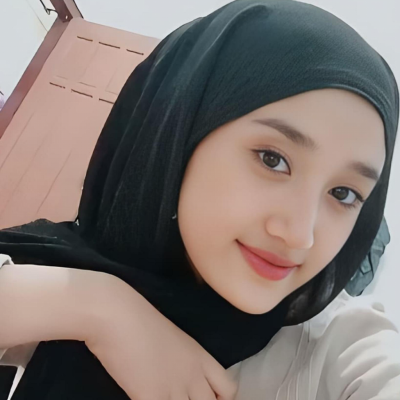

## 💮 OKTAVIA AYU

  

----

  <!-- Banner Header -->
  <h1>Hi 👋, I'm Bagus Al Firmando</h1>
  <h3>A Passionate Tech Enthusiast & Creator</h3>

  

    
  

  <!-- Badges Social Media & Contact -->
  

    
    
    
    
    
  

---

### 🚀 about me

username: Bagus Al Firmando
  role: Tech & Project Enthusiast
  location: Indonesia 🇮🇩
  current_focus: Developing digital solutions & learning cutting-edge tools
  hobbies: 
    - Exploring Tech Gadgets
    - Content Creation
    - Continuous Learning
    
🛠️ Tech Stack & Tools
​

​📊 GitHub Stats
​

 

​ 
​

​⚡ Random Dev Quote
​

​

Designed with ❤️ by Bagus Al Firmando

-
